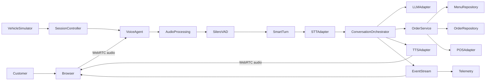
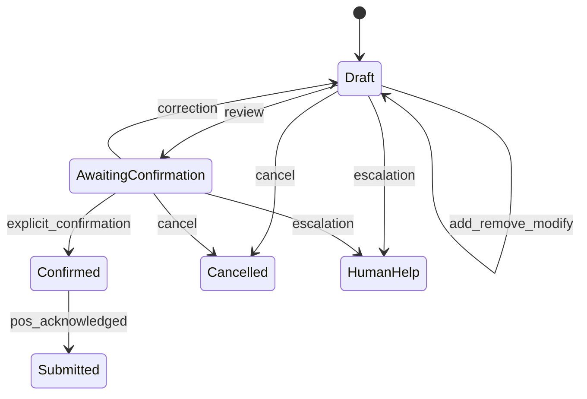

# System architecture

## Design principles

1. The language model interprets language; deterministic code owns inventory,
   modifiers, prices, taxes, order transitions, and POS side effects.
2. Every provider is behind an interface. Mock mode remains a complete product
   path rather than a collection of test stubs.
3. Every streamed frame and UI event carries a session, turn, generation, and
   sequence identity so superseded output cannot reappear after an interruption.
4. Raw audio is ephemeral by default. Diagnostic retention requires explicit
   configuration and consent.
5. Measurements, not vendor claims, determine latency and accuracy.

## Runtime topology

SmallWebRTC is the prototype transport because a browser can communicate
directly with the local agent without a media service account. LiveKit becomes
valuable when multiple lanes, remote operators, SIP, recording/egress, or
distributed media routing are requirements.

## Audio and turn pipeline

WebRTC capture applies echo cancellation, noise suppression, and automatic gain
control before audio reaches the server. Silero VAD then classifies speech
activity; it is not a noise-removal model. A short VAD stop interval triggers
Pipecat Smart Turn, which judges conversational completion. A configurable
silence fallback prevents an incomplete classification from blocking forever.

The initial values are 200 ms VAD stop and 650 ms fallback. These values are
configuration, not cultural assumptions. They must be tuned using labeled
Sri Lankan drive-thru recordings representing accents, natural pauses, engines,
rain, wind, passengers, and speaker feedback.

## Conversation and order boundary

The orchestrator exposes a small tool surface:

- `search_menu`
- `get_menu_item`
- `add_item`
- `set_modifier`
- `remove_item`
- `get_order`
- `confirm_order`
- `request_human`

Tool arguments are validated. Menu references resolve to database identifiers.
Prices are stored as integer minor units and calculated only by the order
domain. Confirmation creates one immutable idempotency key; repeated network
requests return the original POS result.

The order state machine is:

## Barge-in protocol

When verified speech begins during assistant playout:

1. The session controller increments the generation identifier.
2. Browser playout is stopped and queued audio is cleared.
3. Active TTS and LLM tasks receive cancellation.
4. Late chunks tagged with the older generation are discarded at both server
   and browser boundaries.
5. Already committed order events remain; uncommitted generated language does
   not enter conversation history.
6. The new customer turn is transcribed and processed normally.

A short debounce avoids cancelling on a single noisy frame. The measured target
from speech start to silence is below 250 ms.

## Data model

Core records include `LaneSession`, `Turn`, `TranscriptSegment`, `MenuItem`,
`ModifierGroup`, `ModifierOption`, `Order`, `OrderLine`, `OrderEvent`,
`ToolExecution`, `ProviderFailure`, and `LatencySpan`.

All records use UUIDs and UTC timestamps. Session events also use a monotonic
sequence number. Monetary values use minor units plus ISO currency. The
repository interface allows SQLite in the prototype and PostgreSQL in a later
deployment without changing domain logic.

## Failure and privacy policy

- Provider calls have deadlines, bounded retries only for safe transient
  failures, and circuit breakers.
- A failed provider moves the session to `recovering`; it never silently makes a
  paid fallback call.
- Reconnects resume from the latest event sequence and current order snapshot.
- Transcripts are redacted in operational logs. Raw audio is not retained by
  default.
- The customer UI always exposes a human-help path.

## Vehicle detection path

The prototype uses a UI event so software work has no hardware dependency. A
physical pilot should use an IP-rated FMCW presence radar or an installed
inductive loop. A cheap ultrasonic module is useful only for a sheltered bench
experiment, and a camera should be a secondary analytics sensor rather than the
sole all-weather trigger.
